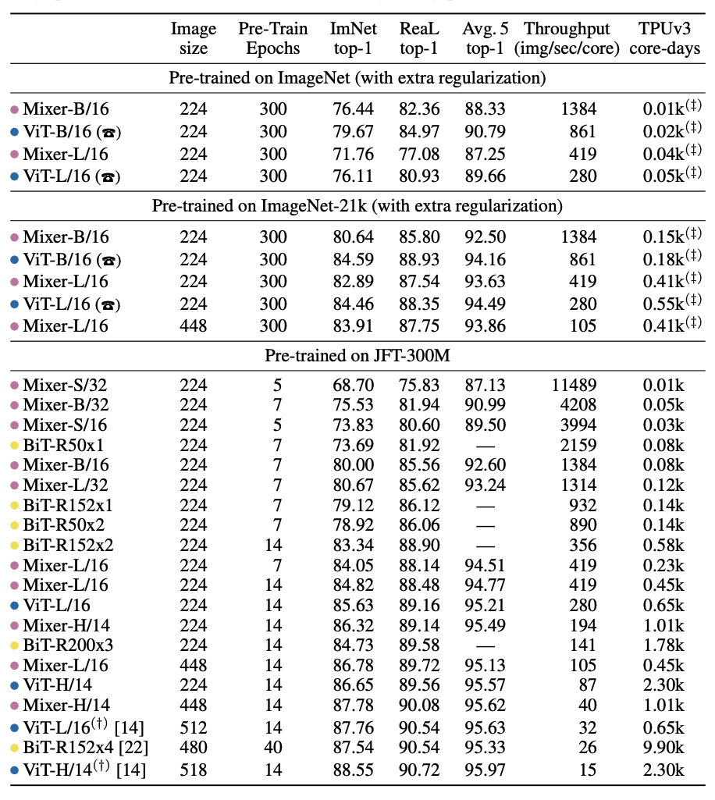

# MLP-Mixer

Pytorch reimplementation of [Google's repository for the MLP-Mixer](https://github.com/google-research/vision_transformer/tree/linen) (Not yet updated on the master branch) that was released with the paper [MLP-Mixer: An all-MLP Architecture for Vision](https://arxiv.org/abs/2105.01601) by Ilya Tolstikhin, Neil Houlsby, Alexander Kolesnikov, Lucas Beyer, Xiaohua Zhai, Thomas Unterthiner, Jessica Yung, Daniel Keysers, Jakob Uszkoreit, Mario Lucic, Alexey Dosovitskiy.

In this paper, the authors show a performance close to SotA in an image classification benchmark using MLP(Multi-layer perceptron) without using CNN and Transformer.


MLP-Mixer (Mixer for short) consists of per-patch linear embeddings, Mixer layers, and a classifier head. Mixer layers contain one token-mixing MLP and one channel-mixing MLP, each consisting of two fully-connected layers and a GELU nonlinearity. Other components include: skip-connections, dropout, and linear classifier head.




## Usage
### 1. Download Pre-trained model (Google's Official Checkpoint)
* [Available models](https://console.cloud.google.com/storage/browser/mixer_models): Mixer-B_16, Mixer-L_16
  * imagenet pre-train models
    * Mixer-B_16, Mixer-L_16
  * imagenet-21k pre-train models
    * Mixer-B_16, Mixer-L_16
```
# imagenet pre-train
wget https://storage.googleapis.com/mixer_models/imagenet1k/{MODEL_NAME}.npz

# imagenet-21k pre-train
wget https://storage.googleapis.com/mixer_models/imagenet21k/{MODEL_NAME}.npz
```

### 2. Fine-tuning
```
python3 train.py --name cifar10-100_500 --model_type Mixer-B_16 --pretrained_dir checkpoint/Mixer-B_16.npz
```


## Reproducing Mixer results
|   upstream   |    model   | dataset | acc(official) | acc(this repo) |
|:------------:|:----------:|:-------:|:-------------:|:--------------:|
|   ImageNet   | Mixer-B/16 | cifar10 |     96.72     |                |
|   ImageNet   | Mixer-L/16 | cifar10 |     96.59     |                |
| ImageNet-21k | Mixer-B/16 | cifar10 |     96.82     |                |
| ImageNet-21k | Mixer-L/16 | cifar10 |     96.34     |                |


## Reference
* [Google's Vision Transformer and MLP-Mixer](https://github.com/google-research/vision_transformer)


## Citations
```bibtex
@article{tolstikhin2021,
  title={MLP-Mixer: An all-MLP Architecture for Vision},
  author={Tolstikhin, Ilya and Houlsby, Neil and Kolesnikov, Alexander and Beyer, Lucas and Zhai, Xiaohua and Unterthiner, Thomas and Yung, Jessica and Keysers, Daniel and Uszkoreit, Jakob and Lucic, Mario and Dosovitskiy, Alexey},
  journal={arXiv preprint arXiv:2105.01601},
  year={2021}
}
```
